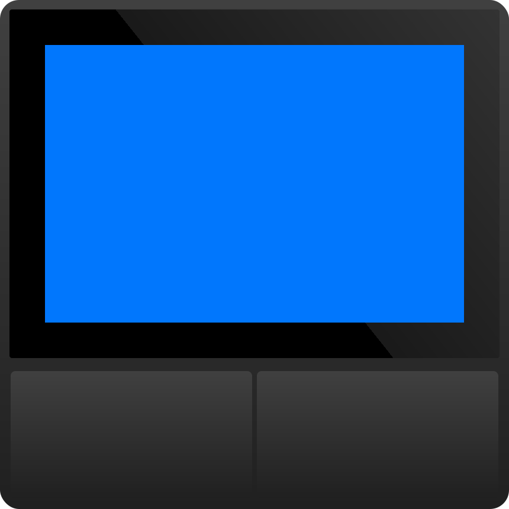

#  ESPHome configurations by [Veli](https://github.com/velijv)

<table>
	<tr>
		<td>     
		<td></td>
		<td></td>
		<td></td>
		<td></td>        
		<td></td>
	</tr>
</table>

<h2>🕹️ <i>Plug & play ▶️</i>  and  configurations </h2>

- for &color=rgba(0,0,0,0.5)&style=flat) and &color=rgba(0,0,0,0.5)&style=flat)
    - *Some are **brand new** creations*
    - *Some are 🧠 brain-transplanted **Tuya** devices*
- 💯 new [devices](#devices) added often

## Instructions

    

<small> I utilize [ESP Web Tools](https://esphome.github.io/esp-web-tools/) for you to 
easily [install my projects onto your devices](https://git.veli.ee/esphome-configs/).</small>

## Devices

1. [ NSPanel   ](https://git.veli.ee/esphome-configs/)
2. SONOFF Switchman M5
    1. 1C
    2. 2C
    3. 3C
3. SONOFF S20 socket
4. SONOFF RE5V1C 
5. Sonoff Basic
5. Tuya HY-08-WE3 thermostat
6. Tuya BHT-006 thermostat
7. Tuya RSH-WiFi-Sky01 Galaxy Projector lamp
8. Tuya S06 IR Controller
9. Zemismart WF25S Roller Shade
10. LILYGO®TTGO T-Higrow
11. Xiaomi Philips Zhirui Downlight
11. ... more

*** 

> 💖 If you find these useful, you can [&color=rgba(234,74,170,0.5) "for jsut 1 doolar you can lead a por man to fish")](https://github.com/sponsors/velijv)  
>  🤝 you can also send me more **ESP-based** or **Tuya** devices you want to see ported to ESPHome

###### All product names, logos, and brands are property of their respective owners. All company, product and service names used are for identification purposes only. Use of these names, logos, and brands does not imply endorsement.

